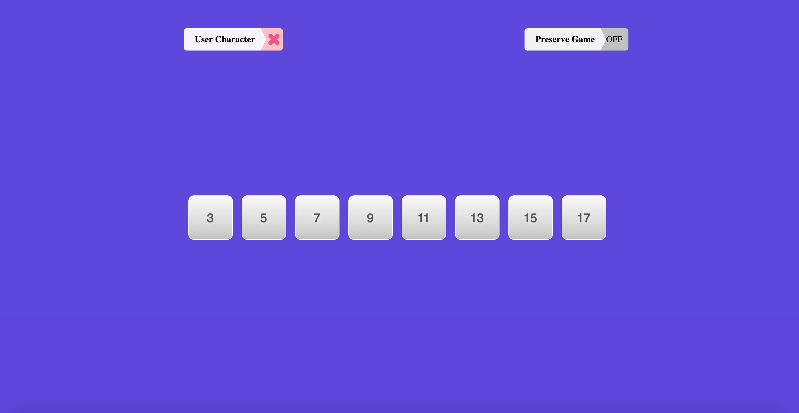
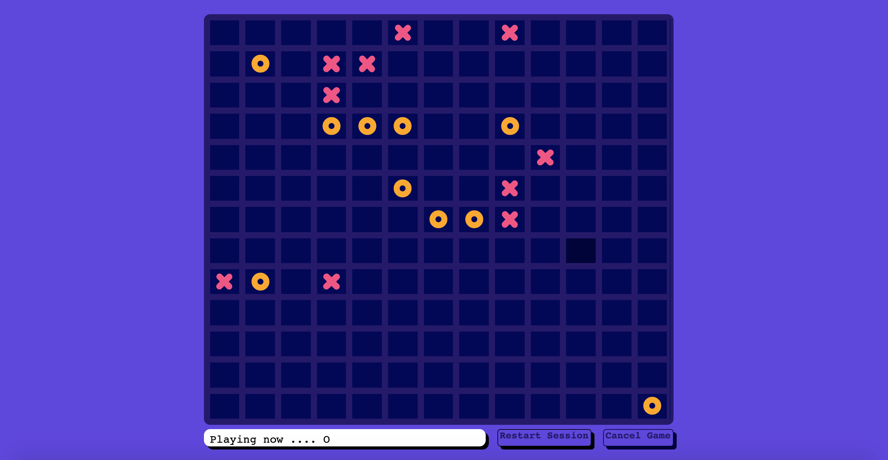

# Tic-Tac-Toe

### Main Board

### Game Board

# Summary

This is a react implementation of tic-tac-toe game to reinforce react concepts as a beginner. Its a browser based game, single page application to keep you engaged for leisure.

State is managed by redux and it is integrated with the browser's local storage based on user's preference seelction.

# UI & Design

The UI design of this project was adopted with permission from the following codepen links

- https://codepen.io/MarioD/pen/VwvLJOP
- https://codepen.io/MarioD/pen/ExVZBjx

The author of the above codepen, https://github.com/MariuszDabrowski is a colleague and resident @ [Codesmith](https://www.codesmith.io/ "leading software engineering immersive in la, nyc & online").

## Learning objectives

- Using JavaScript to change the look and behavior of the DOM
- React to user input
- Utilize object-oriented programming

## Upcoming Features

- a more intuituve business logic for simulating computer moves
- ability to predict a user's move
- animated winning direction

Please feel free to fork and improve this repo and you're very welcomed to creata a PR.
